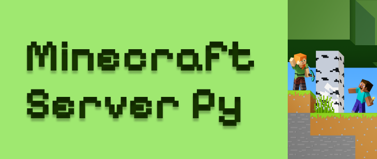

# MINECRATFT SERVER PY VERSION

Цей проект функціонує за допомогою головного файлу, що має назву **kernel**.**py**.
реалізоване меню керування з примітивним GUI
в меню реалізовані пункти для покрокової установки та керування сервером.
# МЕНЮ

 1.  **Встановлення JDK**: Інсталяція Java Development Kit, необхідного для запуску сервера Minecraft (потрібно виконати лише один раз).
    
2.  **Встановлення серверного JAR файлу**: Завантаження останньої стабільної версії серверного JAR файлу для Minecraft (потрібно виконати лише один раз).
    
3.  **Прийняття угоди EULA**: Створення файлу  `eula.txt`  з підтвердженням прийняття угоди користувача.
    
4.  **Встановлення ngrok**: Інсталяція ngrok для створення зовнішнього доступу до сервера Minecraft (необхідно для підключення ззовні).
    
5.  **Налаштування ngrok**: Додавання токена аутентифікації ngrok для налаштування з'єднання.
    
6.  **Запуск сервера та ngrok**: Запуск сервера Minecraft та ngrok для переадресації портів, щоб інші могли підключитися до вашого сервера.
    
7.  **Закриття сервера та ngrok**: Завершення роботи сервера Minecraft та ngrok.
    
8.  **Вихід**: Завершення програми.

## Ресурси використані для створення
1. **[PAPERMC](https://papermc.io/)**-платформа з надання ядра сервера.
2. **[JDK](https://www.oracle.com/cis/java/technologies/downloads/)**-середовище розробки компонентів для java.
3. **[NGROK](https://ngrok.com/)**-сервіс хостингу та переадресації локальних проектів

##  ПРИНЦИП РОБОТИ

при старті виконується функція котра запускає меню 
серед меню користувач може обрати необхідний пункт та система виконає певні дії. також було застосовано tmux для запуску в фоні **jdk** і **ngrok**
